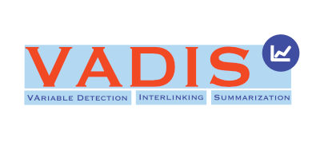

.

Welcome to the homepage of the DFG-funded project **VAriable Detection, Interlinking and Summarization** (VADIS).

[News](#news) - [Project overview](#overview) - [Project results](#results) - [Advisory board](#board) - [Team](#team) - [Funding](#funding)

##  News

* Nov. 12, 2024: [Final workshop](workshop2024.md) with the advisory board.
* VADIS 2 proposal under revision
* Public demo of the VADIS search [https://demo-vadis.gesis.org/](https://demo-vadis.gesis.org/).
* VADIS has been presented in the course "Data Science Techniques for Survey Researchers" at the GESIS Summer School in Survey Methodology in August 2023.
* The Shared Task [SV-Ident 2022: Survey Variable Identification in Social Science Publications](https://vadis-project.github.io/sv-ident-sdp2022/) organized by VADIS will run in co-location with the 3rd Workshop on Scholarly Document Processing at COLING 2022. 
* The VADIS team met for a first face2face meeting in Mannheim, October 29, 2021.

##  Project overview
Nowadays there is a growing trend in many scientific disciplines to support researchers by providing enhanced information access through linking of publications and underlying datasets. Open Science encourages scientific practices in which all research data is interlinked and contextualized to enhance reproducibility and reusability of research results. Ideally, publications that report on a result of an empirical study should thus contain a direct link to the cited dataset and lead the reader directly to the research data that underlies the publication.

However, in practice, standards for referencing between primary text and the cited data and its variables are often missing. A recent user study conducted by GESIS reveals that researchers would considerably benefit from increased linking and semantic annotation of scientific publications. In addition, researchers also demand that data citations should include information at the right granular level of the cited data, thus facilitating the identification and verification of the part of data that actually supports a specific claim. Improving access to scientific publications along the FAIR best practices also requires semantic indexing of texts with salient entities and specific variables that make up the focus of the study – requirements which are rarely addressed today.

The **key vision behind VADIS is to allow for searching und using survey variables in context and thereby help to increase the reproducibility of research results**. We achieve this by combining text mining techniques and semantic web technologies that identify and exploit links between publications, their topics, and the specific variables that are covered in the surveys. These semantic links in scientific texts build the basis for the development of applications to give users better access to scientific literature such as passage search, summarization, and information retrieval.

To achieve this, **we will analyze and link variables in context by identifying references to survey variables within the full text of research literature, creating semantic links based on these references and making the resulting data available as Linked Open Data**. Next, we will develop data-driven profiles of survey variable on the basis of both context-independent and context-dependent metrics. Finally, we will improve the access to survey and literature by providing information on variables from surveys, the developed metrics as well as textual summaries of linked literature. As a result of this, our project will be able to provide improved access to research literature in the social sciences based on the seamless integration within existing infrastructures. To quantify the effectiveness of our framework we design several use case scenarios for a target group of researchers that will be implemented as interfaces for exploration and research. The improvements on information access from experts will be thoroughly investigated in a user study.

### Work packages

Overview of the Work Packages (WPs) of the VADIS project. The colors indicate the lead partners for each of the different WPs. 

## Project results

### Software
- Public demo of the VADIS search [https://demo-vadis.gesis.org/](https://demo-vadis.gesis.org/).
- [Summarization](https://github.com/vadis-project/vadis_summarization_api)
- [Variable Search](https://demo-vadis.gesis.org/variable_search/)
- [VADIS Knowledge Graph](vadiskg.md)
- [Variable citation visualizer on VADIS KG](https://github.com/vadis-project/vadiskg-timeline)
- [Variable topic visualizer on VADIS KG](https://colab.research.google.com/drive/1jzLZGmxyga5ty24HBQGeX_VA8w8plELy?usp=sharing)

### Publications (project publications)

#### Journal

- Takeshita, S., Green, T., Friedrich, N., Eckert, K., Ponzetto, S.P., 2024a. Cross-lingual extreme summarization of scholarly documents. International Journal on Digital Libraries 25, 249–271. [https://doi.org/10.1007/s00799-023-00373-2](https://doi.org/10.1007/s00799-023-00373-2)

#### Conference

- Zielinski, A., Spolwind, C., Kroll, H., 2024. Evaluating Local Explanations for Survey Variable Detection in Scientific Publications. Presented at the Workshop on Scientific Document Understanding 2024. [https://doi.org/10.24406/publica-3256](https://doi.org/10.24406/publica-3256)
- Takeshita, S., Ponzetto, S., Eckert, K., 2024d. GenGO: ACL Paper Explorer with Semantic Features, in: Cao, Y., Feng, Y., Xiong, D. (Eds.), Proceedings of the 62nd Annual Meeting of the Association for Computational Linguistics (Volume 3: System Demonstrations). Association for Computational Linguistics, Bangkok, Thailand, pp. 117–126. [https://doi.org/10.18653/v1/2024.acl-demos.12](https://doi.org/10.18653/v1/2024.acl-demos.12)
- Kartal, Y.S., Shahid, M.A., Takeshita, S., Tsereteli, T., Zielinski, A., Zapilko, B., Mayr, P., 2024. VADIS – A Variable Detection, Interlinking and Summarization System, in: Advances in Information Retrieval: 46th European Conference on Information Retrieval, ECIR 2024, Glasgow, UK, March 24–28, 2024, Proceedings, Part V. Springer-Verlag, Berlin, Heidelberg, pp. 223–228. [https://doi.org/10.1007/978-3-031-56069-9_22](https://doi.org/10.1007/978-3-031-56069-9_22)
- Takeshita, S., Ponzetto, S., Eckert, K., 2024c. ROUGE-K: Do Your Summaries Have Keywords?, in: Bollegala, D., Shwartz, V. (Eds.), Proceedings of the 13th Joint Conference on Lexical and Computational Semantics (*SEM 2024). Presented at the *SEM 2024, Association for Computational Linguistics, Mexico City, Mexico, pp. 69–79. [https://doi.org/10.18653/v1/2024.starsem-1.6](https://doi.org/10.18653/v1/2024.starsem-1.6)
- Takeshita, S., Green, T., Reinig, I., Eckert, K., Ponzetto, S., 2024b. ACLSum: A New Dataset for Aspect-based Summarization of Scientific Publications, in: Duh, K., Gomez, H., Bethard, S. (Eds.), Proceedings of the 2024 Conference of the North American Chapter of the Association for Computational Linguistics: Human Language Technologies (Volume 1: Long Papers). Presented at the NAACL-HLT 2024, Association for Computational Linguistics, Mexico City, Mexico, pp. 6660–6675. [https://doi.org/10.18653/v1/2024.naacl-long.371](https://doi.org/10.18653/v1/2024.naacl-long.371)
- Tsereteli, T, Ponzetto, S., 2023. A Lexico-semantic System for Survey Variable Search, 9th International Conference on Computational Social Science.
- Takeshita, S., Green, T., Friedrich, N., Eckert, K., Ponzetto, S.P., 2022. X-SCITLDR: cross-lingual extreme summarization of scholarly documents, in: Proceedings of the 22nd ACM/IEEE Joint Conference on Digital Libraries, JCDL ’22. Association for Computing Machinery, New York, NY, USA, pp. 1–12. [https://doi.org/10.1145/3529372.3530938](https://doi.org/10.1145/3529372.3530938)

#### Workshops

- Tsereteli, T., Kartal, Y.S., Ponzetto, S.P., Zielinski, A., Eckert, K., Mayr, P., 2022. Overview of the SV-Ident 2022 Shared Task on Survey Variable Identification in Social Science Publications, in: Cohan, A., Feigenblat, G., Freitag, D., Ghosal, T., Herrmannova, D., Knoth, P., Lo, K., Mayr, P., Shmueli-Scheuer, M., de Waard, A., Wang, L.L. (Eds.), Proceedings of the Third Workshop on Scholarly Document Processing. Presented at the sdp 2022, Association for Computational Linguistics, Gyeongju, Republic of Korea, pp. 229–246. [https://aclanthology.org/2022.sdp-1.29/](https://aclanthology.org/2022.sdp-1.29/)
- Hövelmeyer, A., Kartal, Y.S., 2022. Varanalysis@SV-Ident 2022: Variable Detection and Disambiguation Based on Semantic Similarity, in: Cohan, A., Feigenblat, G., Freitag, D., Ghosal, T., Herrmannova, D., Knoth, P., Lo, K., Mayr, P., Shmueli-Scheuer, M., de Waard, A., Wang, L.L. (Eds.), Proceedings of the Third Workshop on Scholarly Document Processing. Presented at the sdp 2022, Association for Computational Linguistics, Gyeongju, Republic of Korea, pp. 247–252. [https://aclanthology.org/2022.sdp-1.30/](https://aclanthology.org/2022.sdp-1.30/)

#### Preprint, under-review

- Tsereteli, T, Ruffinelli, D, Ponzetto, S., 2024. Enriching Social Science Research via Survey Item Linking, Under Review for International Journal on Digital Libraries.
- Kartal, Y.S., Takeshita, S., Tsereteli, T., Eckert, K., Kroll, H., Mayr, P., Ponzetto, S.P., Zapilko, B., Zielinski, A., 2022. Towards Automated Survey Variable Search and Summarization in Social Science Publications. [https://doi.org/10.48550/arXiv.2209.06804](https://doi.org/10.48550/arXiv.2209.06804)

### Workshops

**Kickoff workshop**

The kickoff workshop is planned to be on two afternoons in **September 23-24, 2021** (Thursday/Friday). 
All details about the workshop are here: [Schedule of the workshop](workshop2021.md).

**Final workshop**

The final workshop of VADIS will take place on **November 12, 2024**.
All details about the final worshop can be found here: [Schedule of the workshop](workshop2024.md).

##  Advisory board
- Sören Auer: TIB Hannover, Germany 
- Elizabeth Bishop: GESIS, Cologne, Germany  
- Jan Goebel: SOEP. Berlin, Germany
- Dirk Hovy: Bocconi University, Milano, Italy
- Florian Keusch: University of Mannheim, Germany
- Federico Nanni: the Alan Turing Institute, London, United Kingdom
- Franciska de Jong: University Utrecht, The Netherlands

##  Team

### Contact
Dr. [Philipp Mayr](https://philippmayr.github.io/), philipp.mayr@gesis.org

### Partners
- [GESIS](https://www.gesis.org/en/home) - Leibniz Institute for the Social Sciences, Benjamin Zapilko (PI), Philipp Mayr (PI), Yavuz Selim Kartal (PhD student), Ahsan Shahid (Developer)
- [University of Mannheim](https://www.uni-mannheim.de/en/), Simone Ponzetto (PI), Tornike Tsereteli (PhD student)
- [Stuttgart Media University](https://www.hdm-stuttgart.de/en), Kai Eckert (PI), Sotaro Takeshita (PhD student)
- [Fraunhofer Institute for Systems and Innovation Research ISI](https://www.isi.fraunhofer.de/en.html), Henning Kroll (PI), Andrea Zielinski (PI)

### Related Publications

1.	Boland, K., Ritze, D., Eckert, K., & Mathiak, B. (2012). Identifying references to datasets in publications. In International Conference on Theory and Practice of Digital Libraries (pp. 150-161). Springer, Berlin, Heidelberg. DOI: http://doi.org/10.1007/978-3-642-33290-6_17
2.	Lauscher, A., Glavaš, G., & Eckert, K. (2017). University of Mannheim@ CLSciSumm-17: Citation-based summarization of scientific articles using semantic textual similarity. In CEUR workshop proceedings (Vol. 2002, pp. 33-42). RWTH.
3.	Lauscher, A., Glavaš, G., Ponzetto, S. P., & Eckert, K. (2018a). Investigating the role of argumentation in the rhetorical analysis of scientific publications with neural multi-task learning models. In Proceedings of the 2018 Conference on Empirical Methods in Natural Language Processing (EMNLP) (pp. 3326-3338). https://www.aclweb.org/anthology/D18-1370
4.	Lauscher, A., Glavaš, G., & Eckert, K. (2018b). Arguminsci: A tool for analyzing argumentation and rhetorical aspects in scientific writing. Proceedings of the 5th Workshop on Argument Mining (ArgMining@EMNLP 2018), pp. 22-28. https://www.aclweb.org/anthology/W18-5203/
5.	Nanni, F., Dietz, L., Faralli, S., Glavaš, G., & Ponzetto, S. P. (2016). Capturing interdisciplinarity in academic abstracts. D-lib magazine, 22(9/10). http://doi.org/10.1045/september2016-nanni
6.	Nanni, F., Ponzetto, S. P., & Dietz, L. (2017). Building entity-centric event collections. In 2017 ACM/IEEE Joint Conference on Digital Libraries (JCDL) (pp. 199-208). IEEE.
7.	Nanni, F., Ponzetto, S. P., & Dietz, L. (2018). Entity-aspect linking: providing fine-grained semantics of entities in context. In Proceedings of the 18th ACM/IEEE on Joint Conference on Digital Libraries (pp. 49-58).
8.	Zapilko, B., Boland, K., & Kern, D. (2018). A LOD backend infrastructure for scientific search portals. In European Semantic Web Conference (pp. 729-744). Springer, Cham.
9.	Zielinski, A., & Mutschke, P. (2017). Mining Social Science Publications for Survey Variables. In Proceedings of the Second Workshop on NLP and Computational Social Science (NLP+CSS), pp. 47-52. http://www.aclweb.org/anthology/W17-2907
10.	Zielinski, A., & Mutschke, P. (2018). Towards a Gold Standard Corpus for Variable Detection and Linking in Social Science Publications. In International Conference on Language Resources and Evaluation (LREC).

## Funding
This project is funded by the DFG in the program e-Research Technologies, [project number 448491925](https://gepris-extern.dfg.de/gepris/projekt/448491925), runtime 2021-2024.

