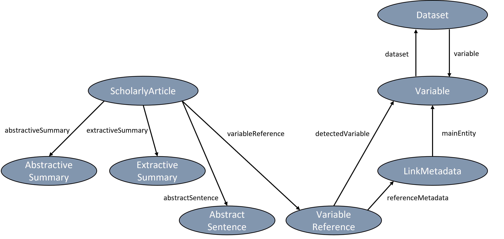

# VADIS Knowledge Graph (VADISKG)

The resulting data corpus containing links between scholarly articles, survey variables, and research datasets has been published as Knowledge Graph.

[Data model](#model) - [Dataset](#dataset) - [Statistics](#statistics)- [License](#license) - [Contact](#contact)

##  Data model

The following figure illustrates a simplified version of the VADISKG data model.

### Namespaces and prefixes

The data model of the VADISKG reuses classes and properties of the following vocabularies while introducing few own classes and properties for which no appropriate equivalent was existing.

* vadiskg: https://data.gesis.org/vadiskg/schema/
* schema: https://schema.org/
* disco: http://rdf-vocabulary.ddialliance.org/discovery#
* gesiskg: https://data.gesis.org/gesiskg/schema/

### Scientific resources in the KG

| Resource name | Class                   |
| :------------ | :---------------------- |
| Publication   | schema:ScholarlyArticle |
| Variable      | disco:Variable          |
| Dataset       | schema:Dataset          |

### Additional entities in the KG

| Entity name | Class              |
| :---------- | :----------------- |
| Person      | schema:Person      |
| Keyword     | schema:DefinedTerm |

### Entities generated by VADIS

| Entity name | Description | Class | Subclass of |
| :------------ | :---------------------- | :---- | :---- |
| Extractive summary | most comprehensive sentence of abstract sentences | vadiskg:ExtractiveSummary | vadiskg:Summary |
| Abstractive summary | tldr extreme summary generated out of the abstract | vadiskg:AbstractiveSummary | vadiskg:Summary |
| Abstract sentence | sentence of the abstract | vadiskg:AbstractSentence | vadiskg:Sentence |
| Variable sentence | sentence containing a variable mention | vadiskg:VariableSentence | vadiskg:Sentence |
| Variable reference | Detected variable in a variable sentence | gesiskg:VariableReference | gesiskg:Reference |

### Link information in the KG

| Metadata name | Description | Property |
| :---------- | :----------------- | :-- |
| Sentence confidence score | Computed confidence score for the detected sentence containing variable mentions | vadiskg:score |
| Method type | Method which has been used to detect the variable sentences | vadiskg:methodType |
| Common words | Common words used in the variable sentence | vadiskg:commonWords |
| Link reason | Part of text which is the basis for the link detection | gesiskg:linkReason |
| Variable similarity score | Computed similarity score for the detected variable in a variable sentence | gesiskg:linkScore |
| Link type | Specifying that the link was automatically generated | gesiskg:linkType |

### URI paths

* Base URI: https://data.gesis.org/vadiskg/ 
* Schema URI: https://data.gesis.org/vadiskg/schema/ 
* Resource URI: https://data.gesis.org/vadiskg/resource/ 
* VADISKG metadata: https://data.gesis.org/vadiskg/id/1 

##  Statistics

* coming soon 

##  Dataset
The VADISKG can be accessed and queried via its SPARQL endpoint. Additionally, the KG and the underlying ontology will be available for download soon.

### SPARQL endpoint

The data within the VADIS Knowledge Graph can be explored using SPARQL queries at the following SPARQL endpoint: [https://data.gesis.org/vadiskg/sparql](https://data.gesis.org/vadiskg/sparql)

You can find some example SPARQL queries here:

##### Example query #1: List all resources from a particular type

The following query lists all publications which are included in the VADISKG. [Result](https://data.gesis.org/vadiskg/sparql?default-graph-uri=&query=SELECT+%3Fid+%3Ftitle%0D%0AWHERE+%7B%3Fid+%3Fp+%3Chttps%3A%2F%2Fschema.org%2FScholarlyArticle%3E.%0D%0A+++++++%3Fid+%3Chttps%3A%2F%2Fschema.org%2Fname%3E+%3Ftitle.%0D%0A%7D+%0D%0ALIMIT+10000&should-sponge=&format=text%2Fhtml&timeout=0&debug=on)

* * * * *
	SELECT ?id ?title
	WHERE {?id ?p <https://schema.org/ScholarlyArticle>.
	       ?id <https://schema.org/name> ?title.
	} 

To retrieve resources from a different type, change <https://schema.org/ScholarlyArticle> accordingly to, e.g., <https://schema.org/Dataset>.

##### Example query #2: List the tldr summaries for all publications

The following query retrieves all publications with their ID and title together with all generated tdlr summaries. [Result](https://data.gesis.org/vadiskg/sparql?default-graph-uri=&query=%09SELECT+%3Fpub_id+%3Fpub_title+%3Ftldr%0D%0A%09WHERE+%7B%3Fpub_id+%3Chttps%3A%2F%2Fschema.org%2Fname%3E+%3Fpub_title+.%0D%0A%09+++++++%3Fpub_id+%3Chttps%3A%2F%2Fdata.gesis.org%2Fvadiskg%2Fschema%2FabstractiveSummary%3E+%3Fsummary+.%0D%0A%09+++++++%3Fsummary+%3Chttps%3A%2F%2Fschema.org%2Ftext%3E+%3Ftldr+.%0D%0A%09%7D+&should-sponge=&format=text%2Fhtml&timeout=0&debug=on)

* * * * *
	SELECT ?pub_id ?pub_title ?tldr
	WHERE {?pub_id <https://schema.org/name> ?pub_title .
	       ?pub_id <https://data.gesis.org/vadiskg/schema/abstractiveSummary> ?summary .
	       ?summary <https://schema.org/text> ?tldr .
	} 

##### Example query #3: List all publications with their linked variables

The following query retrieves all publications (ID and title) with detected variables (ID and question texts). [Result](https://data.gesis.org/vadiskg/sparql?default-graph-uri=&query=%09SELECT+%3Fpub_id+%3Fpub_title+%3Fvar_id+%3Fvar_text%0D%0A%09WHERE+%7B%3Fpub_id+%3Chttps%3A%2F%2Fschema.org%2Fname%3E+%3Fpub_title+.%0D%0A%09+++++++%3Fpub_id+%3Chttps%3A%2F%2Fdata.gesis.org%2Fgesiskg%2Fschema%2FvariableReference%3E+%3Fvar_ref+.%0D%0A%09+++++++%3Fvar_ref+%3Chttps%3A%2F%2Fdata.gesis.org%2Fvadiskg%2Fschema%2FdetectedVariable%3E+%3Fvar_id+.%0D%0A+++++++++++++++%3Fvar_id+%3Chttp%3A%2F%2Frdf-vocabulary.ddialliance.org%2Fdiscovery%23questionText%3E+%3Fvar_text%0D%0A%09%7D+&should-sponge=&format=text%2Fhtml&timeout=0&debug=on)

* * * * *
	SELECT ?pub_id ?pub_title ?var_id ?var_text
	WHERE {?pub_id <https://schema.org/name> ?pub_title .
	       ?pub_id <https://data.gesis.org/gesiskg/schema/variableReference> ?var_ref .
	       ?var_ref <https://data.gesis.org/vadiskg/schema/detectedVariable> ?var_id .
           ?var_id <http://rdf-vocabulary.ddialliance.org/discovery#questionText> ?var_text
	} 

##### Example query #4: List all publications with their links to variables and datasets

The following query adds all linked datasets to the previous query #3. [Result](https://data.gesis.org/vadiskg/sparql?default-graph-uri=&query=%09SELECT+%3Fpub_id+%3Fpub_title+%3Fvar_id+%3Fvar_text+%3Fdataset_id%0D%0A%09WHERE+%7B%3Fpub_id+%3Chttps%3A%2F%2Fschema.org%2Fname%3E+%3Fpub_title+.%0D%0A%09+++++++%3Fpub_id+%3Chttps%3A%2F%2Fdata.gesis.org%2Fgesiskg%2Fschema%2FvariableReference%3E+%3Fvar_ref+.%0D%0A%09+++++++%3Fvar_ref+%3Chttps%3A%2F%2Fdata.gesis.org%2Fvadiskg%2Fschema%2FdetectedVariable%3E+%3Fvar_id+.%0D%0A+++++++++++++++%3Fvar_id+%3Chttp%3A%2F%2Frdf-vocabulary.ddialliance.org%2Fdiscovery%23questionText%3E+%3Fvar_text+.%0D%0A+++++++++++++++%3Fvar_id+%3Chttps%3A%2F%2Fdata.gesis.org%2Fgesiskg%2Fschema%2Fdataset%3E+%3Fdataset_id+.%0D%0A%09%7D+&should-sponge=&format=text%2Fhtml&timeout=0&debug=on)

* * * * *
	SELECT ?pub_id ?pub_title ?var_id ?var_text ?dataset_id
	WHERE {?pub_id <https://schema.org/name> ?pub_title .
	       ?pub_id <https://data.gesis.org/gesiskg/schema/variableReference> ?var_ref .
	       ?var_ref <https://data.gesis.org/vadiskg/schema/detectedVariable> ?var_id .
           ?var_id <http://rdf-vocabulary.ddialliance.org/discovery#questionText> ?var_text .
           ?var_id <https://data.gesis.org/gesiskg/schema/dataset> ?dataset_id .
	} 

### Download

The VADIS Knowledge Graph will be available for download as a full RDF dump as well as its underlying ontology from the following links:

* Dataset: - link coming soon -
* Ontology: - link coming soon -

##  License
The VADIS Knowledge Graph is available for access, download, and reuse under a [Creative Commons Attribution 4.0](https://creativecommons.org/licenses/by/4.0/) license since the license of some input sources is CC-BY as well.

##  Contact
* Benjamin Zapilko, benjamin(dot)zapilko(at)gesis(dot)org
* Muhammad Ahsan Shahid
* Yavuz Selim Kartal

[Back to the VADIS homepage](README.md)
